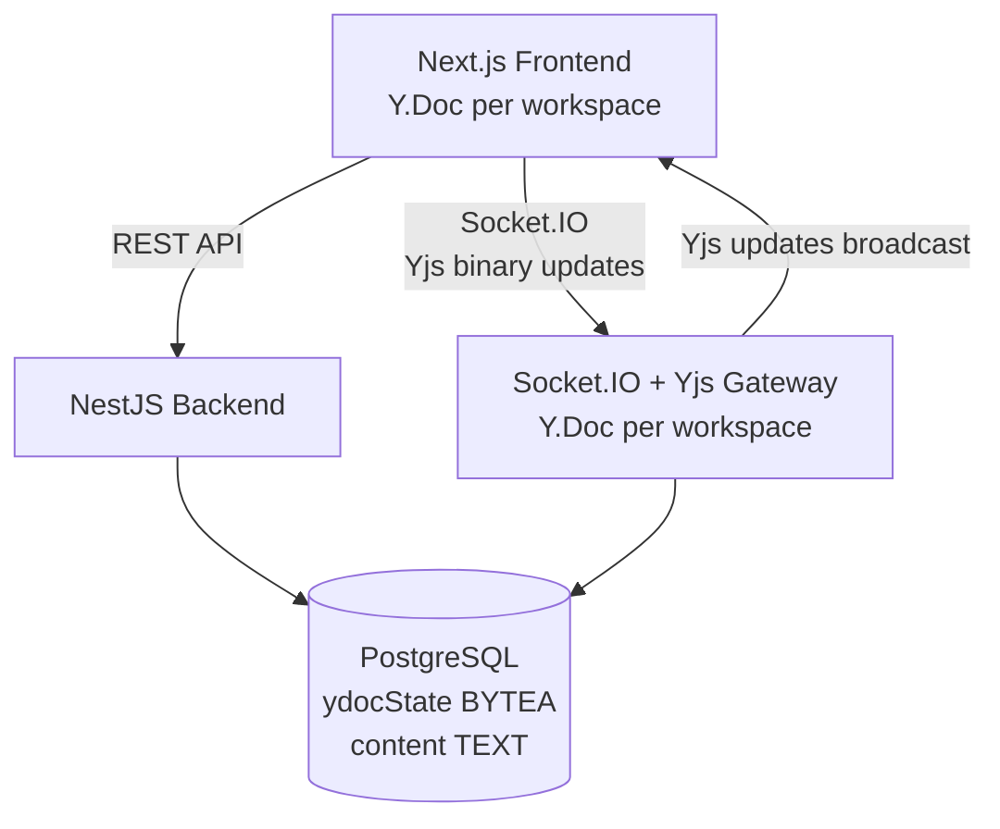

# CollabNotes — Real-Time Collaborative Workspace

A modern, premium collaborative notes application that allows teams to seamlessly create, share, and edit documents in real-time. The application guarantees conflict-free simultaneous editing, live colored carets with cursor presence indicators, interactive activity logs, robust connection resiliency, and sleek class-based theme customization.

---

## 1. Project Overview

CollabNotes is designed for teams requiring fast, zero-latency collaborative documentation. Key features include:

### 1.1 Core Collaboration & Presence
* **Real-time Collaborative Editing**: Write notes concurrently with team members, powered by conflict-free replicated data types (CRDTs).
* **Live User Presence**: See online participants with unique caret positions and hover name tags showing exactly who is editing where.
* **Workspace Activity Feed**: Track real-time events including document edits, joining members, and connection updates.
* **Robust Reconnection**: Automated connection fallback, retry banners, and recovery overlays for offline or network-failure events.

### 1.2 Enhanced Sprint 8 Features
* **Multi-Format Downloads**: Download note contents instantly as PDF, Markdown, Plain Text, or Word Document (.docx) formats directly from the editor toolbar.
* **Note Pinning**: Pin crucial notes to the top of the workspace sidebar for quick navigation. Pinned notes are sorted chronologically by pin date descending.
* **Creator-led Note Locking**: Workspace creators can lock notes in real-time, instantly rendering them read-only for other participants. Non-creators see active banners indicating who locked the note.
* **Workspace Deletion & Leaving**: Workspace creators can permanently delete the workspace (which cascades to all nested notes, logs, and relationships). Participants can opt to leave a workspace at any time.
* **Workspace Member Management**: Creators can review current members and remove participants to revoke workspace access.

### 1.3 Enhanced Sprint 9 Features
* **Note Templates**: Kickstart new notes with structured templates including *Meeting Notes*, *To-Do List*, *Project Brief*, *Weekly Planner*, *Brainstorm*, or start with a *Blank* slate.
* **Keyword Search**: Quick, database-driven keyword search (`ILIKE` on titles and plain-text body snapshots) featuring keyword highlighting and context snippets directly in the sidebar.
* **Workspace Archiving**: Reversible workspace archiving. Archived workspaces are collapsed on the dashboard and accessed in read-only mode, with an option for the creator to unarchive.
* **Workspace ZIP Export**: Stream a zipped folder of all notes exported as text files along with a summary metadata file (`workspace-info.txt`).
* **Command Palette (Cmd+K / Ctrl+K)**: Instant search and command dialog allowing users to lock/unlock, pin/unpin, download, change themes, and navigate workspaces quickly.
* **Real-Time Notification Bell**: Floating bell in the navbar notifying active users in real-time of workspace actions (joins, note locks, pins, and archives) via personal socket rooms (`user:userId`).

### 1.4 Sprint 10 Features
* **Password Reset via Email OTP**: Securely reset credentials using a 6-digit OTP code sent via SMTP (e.g., Mailtrap in development). Features a rate-limiting 60-second request cooldown, 15-minute expiration, single-use validation, and secure bcrypt hashing.
* **In-App Password Update (Change Password)**: Logged-in users can update their passwords through a "Change Password" dialog in the user settings menu, immediately logging them out and invalidating their active session on success.

### 1.5 Sprint 11 Features
* **Profile & Avatar Management**: A dedicated `/profile` editing page for modifying user name, bio (max 160 characters), and avatar photo upload.
* **Local Development Avatar Storage**: Uploaded files are resized to 256x256 cover crop, converted to JPEG, and compressed to 80% quality using `sharp`. Saved in `backend/uploads/avatars/` and served statically.
* **Real-time Identity Propagation**: Updates to name or avatar are instantly propagated to the Navbar, workspace online users panel, and Yjs awareness cursors.

---

## 2. Tech Stack

| Layer | Technology |
|---|---|
| **Frontend** | Next.js 16 (App Router), TypeScript, Tailwind CSS, Shadcn/ui, Tiptap, Yjs, Socket.IO Client, `next-themes`, `cmdk` |
| **Backend** | NestJS, TypeScript, TypeORM, Passport JWT, Socket.IO, Yjs, Archiver, `@nestjs-modules/mailer`, `nodemailer`, `handlebars` |
| **Database** | PostgreSQL |
| **Real-time** | Socket.IO (transport layer) + Yjs CRDT (conflict resolution) |

---

## 3. Architecture Overview

CollabNotes is built on a four-tier architecture combining standard REST API workflows with real-time binary CRDT syncing:

1. **Next.js Frontend**: Serves the UI, handles auth tokens, loads workspace metadata via REST endpoints, and instantiates a local Yjs `Y.Doc` and `Awareness` instance. 
2. **NestJS Backend**: Manages REST routes (user auth, workspace registry), validates JWT access tokens, and controls a Socket.IO Gateway that coordinates in-memory Yjs documents for each active room.
3. **PostgreSQL Database**: Acts as the permanent persistence engine storing User records, Workspace associations, binary document snapshots (`ydocState`), plain text snapshots, Activity Logs, and Password Reset OTPs.
4. **Yjs CRDT Grid**: Ensures conflict-free replication. Both clients and the server hold structured nodes. Updates are converted to lightweight binary delta packets and broadcast over Socket.IO, resulting in mathematical convergence.

### Architecture Data Flow



---

## 4. Getting Started (Local Setup)

Follow these steps to configure and run CollabNotes locally:

### Prerequisites
* **Node.js**: Version 18 or higher.
* **PostgreSQL**: A local database server running on port `5432`.

### Step-by-Step Setup

1. **Clone the Repository**
   ```bash
   git clone <repository-url>
   cd collab-notes
   ```

2. **Configure the Backend**
   Navigate to the backend folder, copy the example environment file, and install standard dependencies:
   ```bash
   cd backend
   cp .env.example .env
   npm install
   ```
    *Edit `.env` and fill in your PostgreSQL credentials (e.g. `DATABASE_USER=postgres`, `DATABASE_PASSWORD=your_password`, `DATABASE_NAME=collab_notes`) and SMTP credentials (e.g. `MAIL_HOST=smtp.mailtrap.io`, `MAIL_PORT=2525`, `MAIL_USER=your_user`, `MAIL_PASS=your_pass`).*

3. **Initialize the Database Schema & Seed**
   Ensure PostgreSQL is running and you have created a database matching `DATABASE_NAME` (e.g., `collab_notes`).
   Run the database seed script to populate default users and workspace parameters:
   ```bash
   npm run start:dev
   # Optional: Run seed script in a separate terminal if needed
   npx ts-node src/database/seed.ts
   ```

4. **Configure the Frontend**
   Navigate to the frontend folder, copy the environment configuration, and install dependencies:
   ```bash
   cd ../frontend
   cp .env.example .env.local
   npm install
   ```

5. **Run the Applications**
   * **Start Backend Server**: In `/backend`, run:
     ```bash
     npm run start:dev
     ```
     The NestJS server will start on port `3001` (REST on `http://localhost:3001/api`).
   * **Start Frontend Dev Server**: In `/frontend`, run:
     ```bash
     npm run dev
     ```
     The Next.js client will start on port `3000`. Navigate to `http://localhost:3000` to register, log in, and begin collaborating.

---

## 5. Environment Variables Reference

### Backend Configurations (`backend/.env`)

| Variable | Description | Example / Default |
|---|---|---|
| `PORT` | NestJS server port | `3001` |
| `DATABASE_HOST` | PostgreSQL hostname | `localhost` |
| `DATABASE_PORT` | PostgreSQL port | `5432` |
| `DATABASE_USER` | PostgreSQL username | `postgres` |
| `DATABASE_PASSWORD`| PostgreSQL password | `yourpassword` |
| `DATABASE_NAME` | PostgreSQL database name | `collab_notes` |
| `JWT_SECRET` | Secret key for JWT signing | `a-long-random-string-used-for-auth` |
| `FRONTEND_URL` | Allowed CORS client origin | `http://localhost:3000` |
| `MAIL_HOST` | SMTP server host | `smtp.mailtrap.io` |
| `MAIL_PORT` | SMTP server port | `2525` / `587` |
| `MAIL_USER` | SMTP server username | `your_username` |
| `MAIL_PASS` | SMTP server password | `your_password` |
| `MAIL_FROM` | Sender display name and email | `"CollabNotes <no-reply@collabnotes.com>"` |

### Frontend Configurations (`frontend/.env.local`)

| Variable | Description | Example / Default |
|---|---|---|
| `NEXT_PUBLIC_API_URL` | Backend REST Base API URL | `http://localhost:3001/api` |
| `NEXT_PUBLIC_SOCKET_URL`| Real-time Socket.IO base URL | `http://localhost:3001` |

---

## 6. API Documentation

All API requests under `/api` require a valid JWT `Authorization: Bearer <token>` header except where noted.

### 6.1 Authentication Endpoints
| Method | Path | Auth | Description | Request Body | Response Shape |
|---|---|---|---|---|---|
| **POST**| `/api/auth/register`| No | Create a new user profile | `{"name": "...", "email": "...", "password": "..."}` | `{"access_token": "...", "user": {...}}` |
| **POST**| `/api/auth/login` | No | Authenticate user credentials | `{"email": "...", "password": "..."}` | `{"access_token": "...", "user": {...}}` |
| **POST**| `/api/auth/forgot-password` | No | Request a password reset OTP | `{"email": "..."}` | `{"message": "..."}` |
| **POST**| `/api/auth/reset-password` | No | Verify OTP and reset password | `{"email": "...", "otp": "...", "newPassword": "...", "confirmPassword": "..."}` | `{"message": "..."}` |
| **PATCH**| `/api/auth/change-password` | Yes | Change password (must be logged in) | `{"currentPassword": "...", "newPassword": "..."}` | `{"message": "..."}` |

### 6.2 Workspace Endpoints
| Method | Path | Auth | Description | Request Body | Response Shape |
|---|---|---|---|---|---|
| **POST**| `/api/workspaces` | Yes | Provision a fresh workspace | `{"name": "Design Notes"}` | `{"id": "uuid", "name": "...", "code": "..."}` |
| **POST**| `/api/workspaces/join`| Yes | Join workspace using invite code| `{"code": "ocean-lamp-74"}` | `{"id": "uuid", "name": "...", "note": {...}}` |
| **GET** | `/api/workspaces` | Yes | List workspaces user belongs to| None | `[{"id": "uuid", "name": "...", "joinedAt": "..."}]` |
| **GET** | `/api/workspaces/:id`| Yes | Fetch metadata + notes + logs | None | `{"id": "...", "name": "...", "notes": [...], "activityLogs": [...]}` |
| **PATCH**| `/api/workspaces/:id/archive`| Yes | Archive a workspace | None | `{"id": "uuid", "isArchived": true}` |
| **PATCH**| `/api/workspaces/:id/unarchive`| Yes | Unarchive a workspace | None | `{"id": "uuid", "isArchived": false}` |
| **DELETE**| `/api/workspaces/:id`| Yes (Creator) | Permanently delete workspace | None | `{"success": true, "membersAffected": 2}` |
| **POST**| `/api/workspaces/:id/leave`| Yes | Leave a joined workspace | None | `{"success": true}` |
| **GET**| `/api/workspaces/:id/export`| Yes | Download workspace plain text as ZIP | None | *(Streams binary ZIP payload)* |
| **GET**| `/api/workspaces/:id/search`| Yes | Search workspace notes | None (Query param: `?q=keyword`) | `[{"id": "...", "title": "...", "snippet": "..."}]` |

### 6.3 Note Endpoints
| Method | Path | Auth | Description | Request Body | Response Shape |
|---|---|---|---|---|---|
| **POST**| `/api/workspaces/:id/notes`| Yes | Create a note (optional template content) | `{"title": "Note Title", "content": "..."}` | `{"id": "...", "title": "...", "content": "..."}` |
| **PATCH**| `/api/workspaces/:id/notes/:noteId`| Yes | Rename note title | `{"title": "New Title"}` | `{"id": "...", "title": "..."}` |
| **PATCH**| `/api/workspaces/:id/notes/:noteId/lock`| Yes (Creator) | Lock note (disable other edits) | None | `{"id": "...", "isLocked": true}` |
| **PATCH**| `/api/workspaces/:id/notes/:noteId/unlock`| Yes (Creator) | Unlock note (allow other edits) | None | `{"id": "...", "isLocked": false}` |
| **PATCH**| `/api/workspaces/:id/notes/:noteId/pin`| Yes | Pin note to top of sidebar | None | `{"id": "...", "isPinned": true}` |
| **PATCH**| `/api/workspaces/:id/notes/:noteId/unpin`| Yes | Unpin note from top of sidebar | None | `{"id": "...", "isPinned": false}` |
| **DELETE**| `/api/workspaces/:id/notes/:noteId`| Yes | Delete a note | None | `{"success": true}` |

### 6.4 Tag Endpoints
| Method | Path | Auth | Description | Request Body | Response Shape |
|---|---|---|---|---|---|
| **GET**| `/api/workspaces/:id/tags`| Yes | List all workspace-wide tags | None | `[{"id": "...", "name": "test", "color": "#color"}]` |
| **POST**| `/api/workspaces/:id/tags`| Yes | Create workspace tag | `{"name": "test", "color": "#6366f1"}` | `{"id": "...", "name": "test", "color": "..."}` |
| **DELETE**| `/api/workspaces/:id/tags/:tagId`| Yes (Creator) | Delete workspace tag | None | `{"success": true}` |
| **POST**| `/api/workspaces/:id/notes/:noteId/tags/:tagId`| Yes | Apply tag to note | None | `{"id": "...", "tags": [...]}` |
| **DELETE**| `/api/workspaces/:id/notes/:noteId/tags/:tagId`| Yes | Remove tag from note | None | `{"id": "...", "tags": [...]}` |

### 6.5 Member Endpoints
| Method | Path | Auth | Description | Request Body | Response Shape |
|---|---|---|---|---|---|
| **GET**| `/api/workspaces/:id/members`| Yes | Get workspace members | None | `[{"userId": "...", "name": "...", "joinedAt": "..."}]` |
| **DELETE**| `/api/workspaces/:id/members/:targetUserId`| Yes (Creator) | Remove participant from workspace | None | `{"success": true}` |

### 6.6 Notification Endpoints
| Method | Path | Auth | Description | Request Body | Response Shape |
|---|---|---|---|---|---|
| **GET**| `/api/notifications`| Yes | Get user notifications list | None | `[{"id": "...", "message": "...", "isRead": false}]` |
| **GET**| `/api/notifications/unread-count`| Yes | Get unread notifications count | None | `{"count": 5}` |
| **PATCH**| `/api/notifications/read-all`| Yes | Mark all user notifications as read | None | `{"success": true}` |
| **PATCH**| `/api/notifications/:id/read`| Yes | Mark notification as read | None | `{"id": "uuid", "isRead": true}` |

### 6.7 Profile Endpoints
| Method | Path | Auth | Description | Request Body | Response Shape |
|---|---|---|---|---|---|
| **GET** | `/api/profile` | Yes | Get current user's profile | None | `{"id": "uuid", "name": "...", "email": "...", "avatarUrl": "...", "bio": "...", "createdAt": "..."}` |
| **PATCH** | `/api/profile` | Yes | Update name and/or bio | `{"name": "...", "bio": "..."}` | `{"id": "uuid", "name": "...", "email": "...", "avatarUrl": "...", "bio": "...", "createdAt": "..."}` |
| **POST** | `/api/profile/avatar` | Yes | Upload avatar image (multipart/form-data) | *(avatar file)* | `{"id": "uuid", "name": "...", "email": "...", "avatarUrl": "...", "bio": "...", "createdAt": "..."}` |
| **DELETE** | `/api/profile/avatar` | Yes | Revert to generated initials avatar | None | `{"id": "uuid", "name": "...", "email": "...", "avatarUrl": null, "bio": "...", "createdAt": "..."}` |

---

## 7. Socket.IO Events Reference

| Event | Origin | Payload Shape | Description |
|---|---|---|---|
| `join_workspace` | Client $\rightarrow$ Server | `{"workspaceId": "uuid", "noteId": "uuid"}` | Emitted to enter a workspace room and initialize sync. |
| `sync_step1` | Server $\rightarrow$ Client | `{"workspaceId": "uuid", "stateVector": number[]}` | Sends server Yjs state vector. Client uses it to determine missing diffs. |
| `sync_step2` | Client $\rightarrow$ Server | `{"workspaceId": "uuid", "update": number[], "clientStateVector": number[]}` | Client returns missing deltas and its own state vector to the server. |
| `sync_complete` | Server $\rightarrow$ Client | `{"workspaceId": "uuid", "update": number[]}` | Server sends client missing updates. Initial synchronization is complete. |
| `workspace_meta` | Server $\rightarrow$ Client | `{"onlineUsers": [...], "activityLogs": [...]}` | Delivers user status counts and historical event logs post-sync. |
| `doc_update` | Client $\rightarrow$ Server | `{"workspaceId": "uuid", "update": number[]}` | Client sends local binary edit updates to the server. |
| `doc_update` | Server $\rightarrow$ Client | `{"workspaceId": "uuid", "update": number[], "updatedBy": {"userId": "...", "name": "..."}}` | Broadcasts edit deltas from one user to all other room participants. |
| `awareness_update`| Client $\rightarrow$ Server | `{"workspaceId": "uuid", "update": number[]}` | Client sends local cursor positions, selected text ranges, and username. |
| `awareness_update`| Server $\rightarrow$ Client | `{"workspaceId": "uuid", "update": number[]}` | Broadcasts cursor/presence details of another active room user. |
| `content_snapshot`| Client $\rightarrow$ Server | `{"workspaceId": "uuid", "content": "string"}` | Pushes a stringified Tiptap JSON document snapshot for backup storage. |
| `user_joined` | Server $\rightarrow$ Client | `{"user": OnlineUser, "onlineUsers": OnlineUser[]}` | Broadcasts when a user joins, updating the participants UI list. |
| `user_left` | Server $\rightarrow$ Client | `{"user": OnlineUser, "onlineUsers": OnlineUser[]}` | Broadcasts when a user disconnects, removing them from the caret list. |
| `note_locked` | Server $\rightarrow$ Client | `{"noteId": "uuid", "lockedBy": {...}}` | Broadcasts note lock status. Non-creators transition to read-only mode. |
| `note_unlocked` | Server $\rightarrow$ Client | `{"noteId": "uuid"}` | Broadcasts note unlock status. Editor becomes editable again. |
| `note_tags_updated` | Server $\rightarrow$ Client | `{"noteId": "uuid", "tags": [...]}` | Broadcasts updated tags of a note. |
| `tag_created` | Server $\rightarrow$ Client | `{"tag": Tag}` | Broadcasts workspace-wide tag creation. |
| `tag_deleted` | Server $\rightarrow$ Client | `{"tagId": "uuid"}` | Broadcasts workspace-wide tag deletion. |
| `workspace_archived`| Server $\rightarrow$ Client | `{"workspaceId": "uuid"}` | Broadcasts workspace archiving. |
| `workspace_unarchived`| Server $\rightarrow$ Client | `{"workspaceId": "uuid"}` | Broadcasts workspace unarchiving. |
| `new_notification`| Server $\rightarrow$ Client | `{"notification": Notification}` | Sent to specific user socket room `user:userId` to notify in real-time. |
| `error` | Server $\rightarrow$ Client | `{"message": "string"}` | Notifies client of failures (e.g. Forbidden: not a workspace member). |

---

## 8. Design Decisions & Bugfix Refinements

* **CRDT with Yjs**: We selected Yjs over typical operational transformation (OT) or "last-write-wins" implementations. CRDTs offer mathematical consistency guarantees where document nodes resolve conflict-free on both client and server regardless of packet arrival order. The `@tiptap/extension-collaboration` package makes wiring Yjs documents into the WYSIWYG editor canvas highly robust.
* **Dual Storage Schema (`ydocState` + `content`)**: The PostgreSQL database stores both the binary Yjs snapshot (`ydocState` BYTEA) and a stringified JSON document structure (`content` TEXT). The binary represents the absolute source of truth for the real-time websocket editor. The plain text content snapshot acts as a lightweight fallback for fast loading on dashboard list views, search queries, or analytics.
* **In-Memory Server-Side Docs**: Active workspace documents are compiled in memory inside NestJS using Yjs `Y.Doc` instances. When the first user connects, the binary state is loaded from PostgreSQL. When the last user disconnects, the in-memory document is garbage-collected. This avoids loading states from the DB for every single keystroke.
* **Socket.IO for Transport**: While Yjs is transport-agnostic, Socket.IO was chosen due to its robust support for rooms, connection fallbacks, automatic reconnect retry protocols, and security authentication integrations.
* **Per-User Undo/Redo**: By isolating edit tracking to individual client history instances within the collaborative context, undoing text edits only affects the local user's keystrokes. It guarantees you never inadvertently revert work done by remote colleagues.
* **Yjs Template State Initialization (Sprint 9 Polish)**: To support note templates seamlessly with collaborative editing, the backend service was modified to populate the initial Yjs `'default'` root XML fragment directly on the server by parsing ProseMirror JSON elements (`heading`, `paragraph`, `bulletList`, `listItem`) when a note's `ydocState` is empty. This prevents new editors from overwriting database template contents with a blank document state.
* **Active Note Row Stacking Context (Popover Polish)**: Sibling note rows in the sidebar list established separate `relative` stacking contexts, resulting in later siblings rendering on top of the absolute-positioned tag popovers of preceding rows. This was resolved by applying a conditional `z-30` class to the note row whose popover is currently active, raising its layer above sibling elements.
* **Notification Bell Badge Utility (CSS Polish)**: Switched the notification unread badge to use standard Tailwind sizes (`size-5` instead of `min-w-4.5` / `h-4.5`) and standard colors (`bg-red-600` instead of `bg-red-650`) to resolve rendering issues and ensure complete visibility across light and dark modes.
* **Archiver ESModules Compatibility**: Fixed export ZIP crashes on ESModules by migrating from standard factory imports to namespace instantiations (`new (archiver as any).ZipArchive(...)`) and handling async stream emitter errors to prevent unhandled process exceptions.
* **Secure OTP Management & Email Dispatch (Sprint 10)**: Password reset OTP codes are bcrypt-hashed prior to database storage, rendering compromised tables non-threatening. Requesting a new OTP invalidates previous active OTPs for the user. Cooldown limits prevent email floods, and all password reset endpoints employ generic response text (regardless of email existence) to guard against user enumeration attacks.
* **Session Invalidation on Password Change**: Logged-in users who change their password are forced to log out immediately. This invalidates their active JWT sessions and demands a fresh authentication phase, upholding robust security practices.

---

## 9. Known Limitations

* **No Horizontal Scaling**: The server maintains active `Y.Doc` state buffers in NestJS memory. If multiple gateway instances are deployed behind a load balancer, clients in different instances will fail to sync. Resolving this requires a horizontal adapter (e.g., Redis Pub/Sub with a centralized database provider).
* **No Asset Embeds**: The WYSIWYG editor supports structured formatting (headings, lists, alignments, underlines) but does not allow direct file uploads or local image embeds, which would require cloud bucket integrations.
* **Snapshot Save Delay**: The REST-readable `content` snapshot database column is synced every 5 seconds. Although the primary `ydocState` binary is saved immediately on disconnect, the plain-text column might lag slightly behind the live cursor state during active typing sessions.
* **Unencrypted Data Storage**: Note contents and binary updates are saved in plain format inside PostgreSQL. Sensitive enterprise workspaces should be protected via column-level database encryption layers.
* **Local Avatar Storage**: Uploaded avatars are stored on the local server filesystem (`backend/uploads/avatars/`) during local development. For production deployments, this local storage should be replaced with a cloud object storage service (e.g. AWS S3, Cloudflare R2, or similar) to support horizontal scaling and containerized deployments.

---

## 10. Profile & Avatar

CollabNotes includes support for personalizing user accounts via profile names, bios, and custom avatars:

* **Avatar Storage**: In the development environment, uploaded avatar images are stored locally under `backend/uploads/avatars/`. They are served statically by NestJS to make them accessible via URL.
* **Sharp Processing**: On upload, image files are processed using the `sharp` library to crop and resize them to a maximum dimension of `256x256px` (cover crop), converted to standard JPEG format, and compressed to `80%` quality to reduce file sizes and load latency.
* **Production Upgrade Path**: Storing files on the local disk is a development-only mechanism. In a production cloud environment, this should be upgraded to use a cloud storage bucket provider (e.g., AWS S3, Cloudflare R2, or Google Cloud Storage) to ensure assets persist across auto-scaling containers and server restarts.
* **Email Constraints**: Once a user registers their account, the associated email address is locked and **cannot be changed**. All updates to profiles are restricted to the display name, bio, and avatar.

