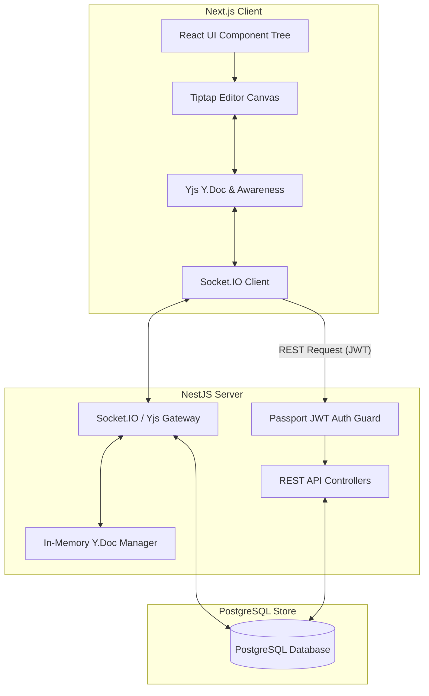

# Architecture Documentation

CollabNotes utilizes a four-tier architecture combining standard REST API workflows with real-time binary CRDT (Conflict-free Replicated Data Type) synchronization to enable collaborative document editing.

---

## High-Level Architecture Diagram

---

## Architectural Component Breakdown

### 1. Next.js Frontend (Client Tier)
* **Framework**: Next.js 16 utilizing the App Router architecture.
* **State Management**: React state handles workspace metadata, notifications, and settings overlays. Document state is completely delegated to Yjs.
* **Editor Layer**: Tiptap WYSIWYG editor canvas coupled with `@tiptap/extension-collaboration` and `@tiptap/extension-collaboration-cursor`.
* **Collaborative State**: A local Yjs `Y.Doc` coordinates document nodes. A Yjs `Awareness` tracker manages client cursors, color codes, and names.
* **Network Gateway**: Socket.IO-client handles the transport connection back to NestJS, transmitting binary Yjs update blobs over WebSocket frames.

### 2. NestJS Backend (Server Tier)
* **Framework**: NestJS server architecture written in TypeScript.
* **REST Services**: Express controllers handle typical transactions (user registration, login authentication, password reset pipelines, workspace creation, membership rosters, tag creation).
* **Real-time Gateway**: NestJS WebSockets Gateway wrapper around Socket.IO. Authenticates connections via JWT queries and associates sockets to workspace room channels.
* **In-Memory Document Store**: Active rooms map to server-side `Y.Doc` instances. When the first participant arrives, the server constructs a `Y.Doc` and seeds it from the database byte buffer. Keystrokes are captured, integrated, and broadcast. When the last participant leaves, the `Y.Doc` state is saved to the database and garbage-collected to save memory.

### 3. PostgreSQL Database (Storage Tier)
* **Type**: Relational PostgreSQL database managed via TypeORM.
* **Document Persistence**: Stored via a dual-column model:
  1. `ydocState` (`BYTEA` binary): Contains compressed update logs of the Yjs document state. This is the source of truth loaded into memory on server startup.
  2. `content` (`TEXT` JSON structure): A serialized ProseMirror JSON string representing document nodes, updated periodically (every 5 seconds). Used for fast search indexing (`ILIKE` queries) and rendering document lists without loading the full collaborative binary context.

---

## Collaboration & Sync Data Flow

```mermaid
sequenceDiagram
    autonumber
    actor Client A as Client A (Editor)
    participant Server as NestJS Gateway
    actor Client B as Client B (Editor)
    
    Client A->>Server: join_workspace { workspaceId, noteId }
    Note over Server: Load ydocState BYTEA from DB if first client
    Server-->>Client A: sync_step1 { stateVector }
    Client A->>Server: sync_step2 { clientStateVector, updateBlob }
    Note over Server: Apply Client A updates to server Y.Doc
    Server-->>Client A: sync_complete { serverUpdateBlob }
    Server-->>Client A: workspace_meta { onlineUsers, activityLogs }
    
    rect rgb(30, 41, 59)
        note over Client A, Client B: Live Collaborative Editing Loop
        Client A->>Server: doc_update { updateBlob }
        Note over Server: Apply update to server Y.Doc
        Server-->>Client B: doc_update { updateBlob, updatedBy }
        Note over Client B: Client B merges diffs locally
    end
```

### 1. Connection & Synchronization Handshake
1. **Room Entry**: The client emits `join_workspace` containing the target UUIDs.
2. **State Sync (Step 1)**: The server computes its current Yjs State Vector (the summary of edits it has recorded) and returns it to the client via `sync_step1`.
3. **Difference Push (Step 2)**: The client compares the server's state vector with its own document, packages missing deltas into a binary block, and pushes it back via `sync_step2` alongside the client's own State Vector.
4. **Final Catch-up**: The server applies the client's updates. It then computes what updates the client is missing and returns them via `sync_complete`. The client merges these updates, finalizing synchronization.

### 2. Live Presence Tracking (Awareness)
* Cursor positions, selection ranges, names, and customized color tags are handled via Yjs `Awareness` protocols.
* These details are volatile and are not stored in the database.
* Local updates are captured on client mouse/input movements and dispatched over the WebSocket room via `awareness_update` to keep all concurrent cursors updated with zero latency.
