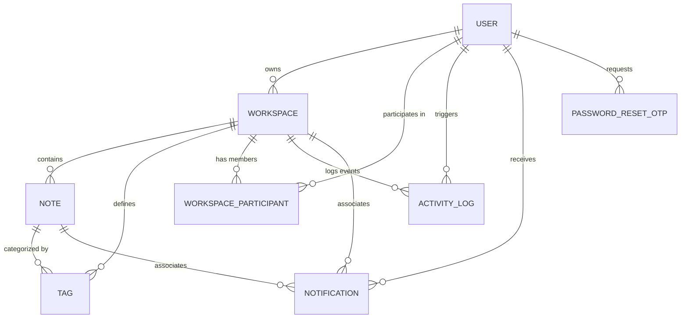

# Database Schema

CollabNotes utilizes a PostgreSQL database managed via TypeORM in the NestJS backend. Below is the detailed schema documentation for all entity tables.

---

## Entity Relationship Overview

---

## Table Schemas

### 1. `User` Table
Stores user profile information, authentication credentials, and metadata.

| Column | Type | Constraints | Description |
|---|---|---|---|
| `id` | `uuid` | `PRIMARY KEY`, Generated | Unique identifier for the user. |
| `name` | `varchar` | `NOT NULL` | The user's display name. |
| `email` | `varchar` | `NOT NULL`, `UNIQUE` | Email address used for authentication. |
| `password` | `varchar` | `NOT NULL` | Bcrypt-hashed password. |
| `avatarUrl` | `varchar` | `NULL` | Path/URL to the uploaded avatar (or `null` if using initials). |
| `bio` | `varchar(160)`| `NULL` | A short biography (maximum 160 characters). |
| `createdAt` | `timestamp` | `DEFAULT now()` | Date and time when the user signed up. |
| `updatedAt` | `timestamp` | `DEFAULT now()` | Date and time when the user profile was last updated. |

---

### 2. `Workspace` Table
Stores workspace workspace parameters and creator association.

| Column | Type | Constraints | Description |
|---|---|---|---|
| `id` | `uuid` | `PRIMARY KEY`, Generated | Unique identifier for the workspace. |
| `name` | `varchar` | `NOT NULL` | Display name of the workspace. |
| `code` | `varchar` | `NOT NULL`, `UNIQUE`, `INDEX` | Invite code used to join the workspace (e.g., `ocean-lamp-74`). |
| `isArchived` | `boolean` | `DEFAULT false` | Indicates if the workspace has been archived. |
| `archivedAt` | `timestamp` | `NULL` | Timestamp when the workspace was archived. |
| `createdById` | `uuid` | `FOREIGN KEY` | Reference to the `User` who created the workspace. `ON DELETE CASCADE`. |
| `createdAt` | `timestamp` | `DEFAULT now()` | Date and time of workspace creation. |

---

### 3. `WorkspaceParticipant` Table
Maps users to the workspaces they have joined.

| Column | Type | Constraints | Description |
|---|---|---|---|
| `id` | `uuid` | `PRIMARY KEY`, Generated | Unique identifier for the relationship. |
| `workspaceId` | `uuid` | `FOREIGN KEY`, `NOT NULL` | Reference to the `Workspace`. `ON DELETE CASCADE`. |
| `userId` | `uuid` | `FOREIGN KEY`, `NOT NULL` | Reference to the `User`. `ON DELETE CASCADE`. |
| `joinedAt` | `timestamp` | `DEFAULT now()` | Date and time when the user joined the workspace. |

*Indexes:*
* Unique multi-column index `idx_workspace_participant_unique` on `(workspaceId, userId)`.

---

### 4. `Note` Table
Contains the actual documents/notes created within workspaces, their collaborative binary data, and locking/pinning states.

| Column | Type | Constraints | Description |
|---|---|---|---|
| `id` | `uuid` | `PRIMARY KEY`, Generated | Unique identifier for the note. |
| `title` | `varchar` | `DEFAULT 'Untitled Note'` | Display title of the note. |
| `order` | `integer` | `DEFAULT 0` | Sidebar rendering sort order. |
| `content` | `text` | `DEFAULT '{"type":"doc"...}'` | JSON plain-text snapshot used for quick loads and searches. |
| `ydocState` | `bytea` | `NULL` | Binary Yjs document snapshot (canonical state representation). |
| `isLocked` | `boolean` | `DEFAULT false` | True if the note is currently locked (read-only for non-creators). |
| `lockedById` | `uuid` | `FOREIGN KEY`, `NULL` | Reference to the `User` who locked the note. `ON DELETE SET NULL`. |
| `lockedAt` | `timestamp` | `NULL` | Timestamp when the note was locked. |
| `isPinned` | `boolean` | `DEFAULT false` | True if the note is pinned by a user. |
| `pinnedAt` | `timestamp` | `NULL` | Timestamp when the note was pinned. |
| `workspaceId` | `uuid` | `FOREIGN KEY`, `NOT NULL` | Reference to parent `Workspace`. `ON DELETE CASCADE`. |
| `createdAt` | `timestamp` | `DEFAULT now()` | Creation timestamp. |
| `updatedAt` | `timestamp` | `DEFAULT now()` | Last modification timestamp. |

---

### 5. `Tag` Table
Workspace-wide tags that can be applied to individual notes.

| Column | Type | Constraints | Description |
|---|---|---|---|
| `id` | `uuid` | `PRIMARY KEY`, Generated | Unique identifier for the tag. |
| `name` | `varchar(30)` | `NOT NULL` | Label text of the tag (max 30 characters). |
| `color` | `varchar` | `NOT NULL` | Hex color code for tag rendering (e.g., `#6366f1`). |
| `workspaceId` | `uuid` | `FOREIGN KEY`, `NOT NULL` | Reference to parent `Workspace`. `ON DELETE CASCADE`. |
| `createdAt` | `timestamp` | `DEFAULT now()` | Creation timestamp. |

*Constraints:*
* Unique multi-column constraint on `(workspaceId, name)` ensures tag names are unique within a single workspace.

---

### 6. `NoteTags` Junction Table
Many-to-many relationship mapping notes to tags.

| Column | Type | Constraints | Description |
|---|---|---|---|
| `noteId` | `uuid` | `FOREIGN KEY`, `NOT NULL` | Reference to the `Note`. `ON DELETE CASCADE`. |
| `tagId` | `uuid` | `FOREIGN KEY`, `NOT NULL` | Reference to the `Tag`. `ON DELETE CASCADE`. |

---

### 7. `ActivityLog` Table
Chronological log of events triggered within workspaces.

| Column | Type | Constraints | Description |
|---|---|---|---|
| `id` | `uuid` | `PRIMARY KEY`, Generated | Unique identifier for the log entry. |
| `eventType` | `enum` | `NOT NULL` | Type of event (`user_joined`, `note_created`, `note_locked`, etc.). |
| `metadata` | `jsonb` | `NULL` | Structured payload (e.g., note title, username, file size). |
| `workspaceId` | `uuid` | `FOREIGN KEY`, `NOT NULL`| Reference to parent `Workspace`. `ON DELETE CASCADE`. |
| `userId` | `uuid` | `FOREIGN KEY`, `NULL` | Reference to the initiating `User`. `ON DELETE SET NULL`. |
| `createdAt` | `timestamp` | `DEFAULT now()` | Timestamp of the event. |

*Indexes:*
* Index `idx_activity_log_workspace_id` on `workspaceId`.

---

### 8. `Notification` Table
Floating notifications sent to active users in real-time.

| Column | Type | Constraints | Description |
|---|---|---|---|
| `id` | `uuid` | `PRIMARY KEY`, Generated | Unique identifier for the notification. |
| `userId` | `uuid` | `FOREIGN KEY`, `NOT NULL` | Recipient user's ID. `ON DELETE CASCADE`. |
| `workspaceId` | `uuid` | `FOREIGN KEY`, `NULL` | Reference to the related `Workspace`. `ON DELETE CASCADE`. |
| `noteId` | `uuid` | `FOREIGN KEY`, `NULL` | Reference to the related `Note`. `ON DELETE CASCADE`. |
| `eventType` | `enum` | `NOT NULL` | Event type mapped from `ActivityLog`. |
| `message` | `varchar` | `NOT NULL` | Plain-text descriptive notification message. |
| `isRead` | `boolean` | `DEFAULT false` | Indicates if the user has viewed the notification. |
| `createdAt` | `timestamp` | `DEFAULT now()` | Notification generation timestamp. |

*Indexes:*
* Index on `(userId, isRead)`.

---

### 9. `PasswordResetOtp` Table
Secure storage for one-time passcodes during forgot-password sequences.

| Column | Type | Constraints | Description |
|---|---|---|---|
| `id` | `uuid` | `PRIMARY KEY`, Generated | Unique identifier. |
| `userId` | `uuid` | `FOREIGN KEY`, `NOT NULL` | Recipient user's ID. `ON DELETE CASCADE`. |
| `email` | `varchar` | `NOT NULL`, `INDEX` | Email address requesting the OTP. |
| `otp` | `varchar` | `NOT NULL` | Bcrypt-hashed 6-digit OTP code. |
| `expiresAt` | `timestamp` | `NOT NULL` | Code expiration threshold (15 minutes). |
| `isUsed` | `boolean` | `DEFAULT false` | Tracks if the passcode has already been validated. |
| `createdAt` | `timestamp` | `DEFAULT now()` | Creation timestamp. |
