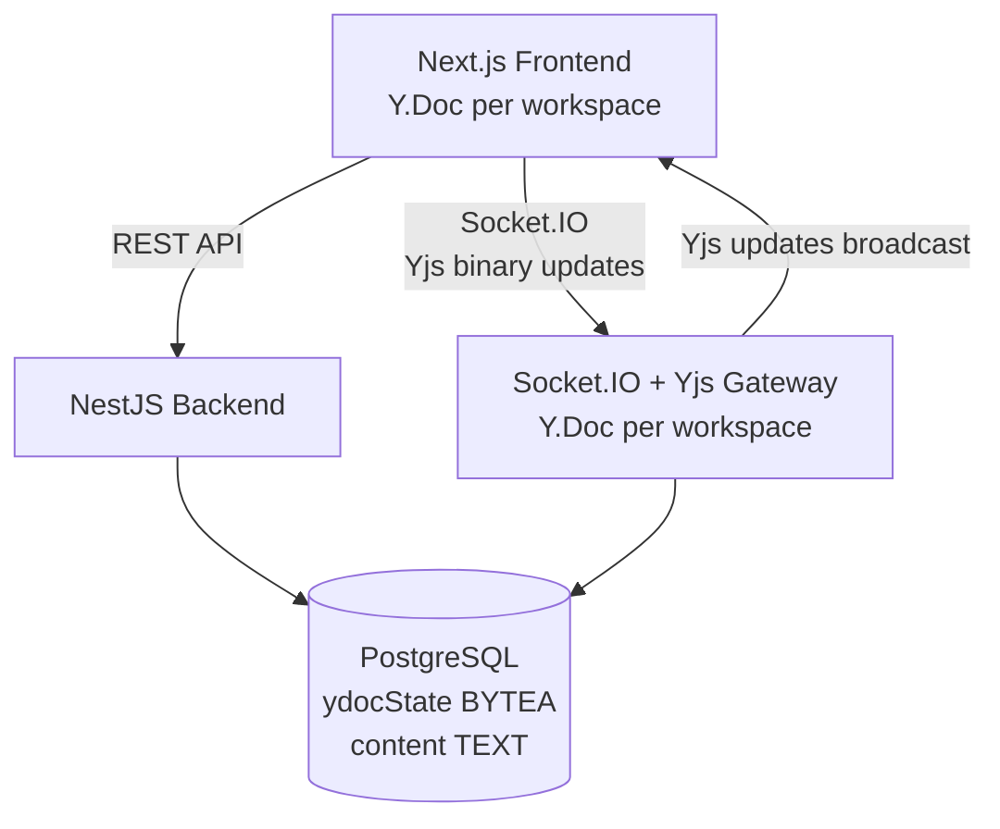

# Sprint 7 — Edge Cases, Polish & Documentation

## Goal
Harden the application against real-world usage scenarios, polish every surface of the UI, and produce complete documentation. By the end of this sprint, the application is production-ready, handles all failure modes gracefully, looks and feels professional on all screen sizes, and is fully documented for submission.

---

## Edge Case Handling

### 1. Page Refresh on the Workspace Page

When a user refreshes the workspace page (`/workspace/[id]`):
- The `useCollaboration` hook unmounts, destroying the `Y.Doc`, Awareness, and socket connection
- On remount, a new `Y.Doc` is created and the full sync handshake (`join_workspace` → `sync_step1` → `sync_step2` → `sync_complete`) runs again
- The server sends the full persisted `ydocState` from the database so the new `Y.Doc` is immediately up to date
- Tiptap renders the content automatically from the restored `Y.Doc` — no extra work needed

**Verify:** Refresh the browser mid-session. The editor should repopulate with the latest content within the time of the socket reconnect. Other users should see the refreshing user briefly disappear and reappear in the Online Users panel.

---

### 2. User Disconnect / Reconnect (Network Interruption)

Configure the Socket.IO client in `useCollaboration` with:
```
reconnection: true
reconnectionAttempts: 5
reconnectionDelay: 1000
reconnectionDelayMax: 5000
```

**While disconnected:**
- `isConnected` state in the hook becomes `false`
- The editor becomes non-editable (`editable={false}` passed to `RichTextEditor`)
- The disconnection warning banner appears above the editor: `"⚠️ Connection lost. Attempting to reconnect..."`
- The connection status indicator in the navbar switches to a yellow dot with `"Reconnecting..."`

**On reconnect:**
- The full sync handshake runs again automatically (socket reconnects and re-emits `join_workspace`)
- `isConnected` becomes `true`
- The banner disappears and the editor becomes editable again
- Any edits the user attempted while offline are queued by Yjs and will sync on reconnect — because Yjs is CRDT-based, these offline edits merge cleanly with any changes made by other users in the meantime

**After 5 failed reconnection attempts:**
- Show a full-width red banner: `"Unable to reconnect. Please refresh the page."`
- Add a `"Refresh"` button that calls `window.location.reload()`

---

### 3. Simultaneous Edits — CRDT Guarantee

> **This is no longer an edge case to handle — it is handled automatically by Yjs.**

Unlike the original "last write wins" approach, Yjs CRDT mathematically guarantees that simultaneous edits from multiple users are merged without data loss. Both users' edits will appear in the document. No special handling is required in application code.

The only thing to verify is that the Tiptap editor is correctly wired to the `Y.Doc` (done in Sprint 6). If the wiring is correct, conflict resolution is automatic.

**Verify:** Have two users type in the same paragraph at the same time. Both users' text should appear merged in the document for both users. Neither user's text should be lost.

---

### 4. Invalid Workspace Code in Join Dialog

Final pass on the Join Workspace dialog (built in Sprint 4):
- The dialog stays open on a `404` response
- Error message appears inline below the input field in red
- The input field border turns red (`border-red-500`)
- The error clears when the user starts typing again (on `onChange`)
- Pressing `Enter` in the input submits the form
- Submitting with an empty field shows an inline validation error without making an API call

---

### 5. Unauthorized Workspace Access

If a user navigates directly to `/workspace/some-id` without being a participant:
- `GET /api/workspaces/:id` returns `403 Forbidden`
- Redirect to `/dashboard` with toast: `"You don't have access to that workspace"`

If the workspace ID does not exist:
- `GET /api/workspaces/:id` returns `404`
- Redirect to `/dashboard` with toast: `"Workspace not found"`

Also handle the socket-level check: if `join_workspace` is emitted for a workspace the user is not a participant of, the gateway emits an `error` event. The hook listens for this and redirects to `/dashboard` with a toast.

---

### 6. Token Expiry During an Active Session

If the JWT expires while the user has the workspace page open:
- The next REST API call receives a `401` — the Axios interceptor redirects to `/login`
- On socket reconnect with an expired token: the gateway rejects the connection and emits an `error` event
- The hook listens for `connect_error` — if the error indicates an auth failure, show a toast: `"Your session has expired. Please sign in again."` and redirect to `/login` after a 2-second delay

---

### 7. Empty or Corrupted Note Content

When the `ydocState` in the database is `null` (new workspace, never edited):
- `YdocStoreService.getOrCreate(workspaceId, null)` creates a fresh `Y.Doc`
- The client receives an empty document update and Tiptap shows the placeholder text: `"Start writing your note..."`

When `ydocState` exists but is corrupted (rare edge case):
- Wrap `Y.applyUpdate(doc, state)` in a `try/catch` on the backend
- If it throws, log the error and initialize a fresh `Y.Doc` instead — do not crash the gateway
- On the frontend, if `Y.applyUpdate` throws when applying `sync_complete`, catch the error, destroy and recreate the `Y.Doc`, and log a warning to the console

---

## UI Polish

### Responsive Layout

Make the workspace page work on tablet and mobile screens (below the `lg` breakpoint, 1024px):
- Hide the sidebar (the right panel with Online Users and Activity Feed) by default on small screens
- Add a floating action button in the bottom-right corner with a `Users` icon that opens a Shadcn `Drawer` containing the `OnlineUsers` and `ActivityFeed` components
- Show a badge count on the floating button indicating how many users are online (e.g. `"3"` in a small green circle)
- The editor and toolbar take full width on small screens
- On the dashboard, the two action cards stack vertically on mobile
- All dialogs are full-width on mobile (Shadcn Dialog handles this with `sm:max-w-lg`)

### Dark Mode

Add a dark mode toggle to the navbar (both dashboard and workspace page navbars):
- Use a `Sun` / `Moon` icon from Lucide
- Install and configure `next-themes`: `npm install next-themes`
- Wrap the app in `<ThemeProvider attribute="class" defaultTheme="system">` in `app/layout.tsx`
- Toggle calls `setTheme('dark')` or `setTheme('light')`
- Preference persists automatically via `next-themes`
- Verify all components look correct in dark mode — Shadcn/ui and Tailwind handle most styling automatically

**Extra dark mode check for the editor:** Make sure the Tiptap editor content area has `dark:bg-slate-900` and `dark:text-slate-100`. The `prose-invert` Tailwind Typography class handles heading and paragraph colors in dark mode. The collaboration cursor CSS may need a dark mode override for label readability.

### Loading Skeletons

Add Shadcn `Skeleton` to all loading states:
- **Dashboard workspace list:** 3 skeleton cards with approximate shapes (a wide bar for title, a small badge shape, a button shape)
- **Workspace page initial load:** Skeleton for the toolbar height and a large skeleton block for the editor area while workspace data loads
- **Sidebar:** Skeleton rows for the online users list while the socket connects (`isConnected` is false on mount)

### Page Transitions

Apply subtle fade-in animations using Tailwind's animate utilities (`tailwindcss-animate` is already installed by Shadcn):
- `animate-in fade-in duration-300` on the main content area of pages
- `animate-in slide-in-from-bottom-4 duration-200` on dialogs and drawers

### Join Code UI — Final Polish

Everywhere the join code appears:
- Display in a rounded `Badge` with `font-mono` (monospace font)
- A `Copy` icon button next to it — on click:
  - Copy the code to clipboard using `navigator.clipboard.writeText(code)`
  - Switch the icon to a `Check` for 2 seconds, then back to `Copy`
  - Show a Sonner toast: `"Code copied to clipboard!"`
- The badge should have good contrast in both light and dark mode (`bg-indigo-50 text-indigo-700 dark:bg-indigo-950 dark:text-indigo-300`)

### 404 Page

Create `app/not-found.tsx`:
- Centered full-screen layout
- Large muted `"404"` number
- Heading: `"Page not found"`
- Description: `"The page you're looking for doesn't exist or has been moved."`
- `"Go to Dashboard"` button linking to `/dashboard`

### Global Error Boundary

Create `app/error.tsx`:
- Friendly message: `"Something went wrong"`
- Description: `"An unexpected error occurred. Try refreshing the page."`
- `"Try again"` button calling `reset()` from Next.js error boundary props
- `"Go to Dashboard"` link

---

## Documentation

### README.md (Final Version)

Update the root `README.md` with all 9 sections:

---

**1. Project Overview**

What the app does, who it's for, and the key features: real-time collaborative rich text editing with CRDT conflict resolution, live user presence with colored cursors, activity feed, and persistent workspaces.

---

**2. Tech Stack**

| Layer | Technology |
|---|---|
| Frontend | Next.js 14, TypeScript, Tailwind CSS, Shadcn/ui, Tiptap, Yjs, Socket.IO Client |
| Backend | NestJS, TypeScript, TypeORM, Passport JWT, Socket.IO, Yjs |
| Database | PostgreSQL |
| Real-time | Socket.IO (transport) + Yjs CRDT (conflict resolution) |

---

**3. Architecture Overview**

Describe the four layers in plain language:
- The **Next.js frontend** handles UI, makes REST API calls for initial data loading, and maintains a `Y.Doc` per workspace that syncs via Socket.IO
- The **NestJS backend** handles REST endpoints for auth and workspace management, and runs a Socket.IO gateway that maintains the server-side `Y.Doc` for each active workspace
- **PostgreSQL** stores users, workspaces, the binary Yjs document state (`ydocState`), a plain-text content snapshot, and activity logs
- **Yjs CRDT** runs on both client and server — each client holds a local copy of the document and Yjs automatically merges all edits conflict-free via the Socket.IO transport

Include a Mermaid diagram:


---

**4. Getting Started (Local Setup)**

Step-by-step:
1. Prerequisites: Node.js 18+, PostgreSQL 14+ running locally
2. Clone the repo
3. `cd backend && npm install`
4. Copy `backend/.env.example` to `backend/.env` and fill in: database credentials, `JWT_SECRET` (any long random string), `PORT=3001`, `FRONTEND_URL=http://localhost:3000`
5. `cd frontend && npm install`
6. Copy `frontend/.env.local.example` to `frontend/.env.local`
7. Start backend: `cd backend && npm run start:dev`
8. Optional seed: `cd backend && npx ts-node src/database/seed.ts`
9. Start frontend: `cd frontend && npm run dev`
10. Open `http://localhost:3000`, register an account, and create a workspace

---

**5. Environment Variables Reference**

Backend table:

| Variable | Description | Example |
|---|---|---|
| `DATABASE_HOST` | PostgreSQL host | `localhost` |
| `DATABASE_PORT` | PostgreSQL port | `5432` |
| `DATABASE_USER` | Database username | `postgres` |
| `DATABASE_PASSWORD` | Database password | `yourpassword` |
| `DATABASE_NAME` | Database name | `collab_notes` |
| `JWT_SECRET` | Secret for signing JWTs | `a-long-random-string` |
| `PORT` | NestJS server port | `3001` |
| `FRONTEND_URL` | Allowed CORS origin | `http://localhost:3000` |

Frontend table:

| Variable | Description | Example |
|---|---|---|
| `NEXT_PUBLIC_API_URL` | Backend REST base URL | `http://localhost:3001/api` |
| `NEXT_PUBLIC_SOCKET_URL` | Socket.IO server URL | `http://localhost:3001` |

---

**6. API Documentation**

| Method | Path | Auth | Description |
|---|---|---|---|
| GET | /api/health | No | Health check |
| POST | /api/auth/register | No | Register a new user. Body: `{ name, email, password }`. Returns `{ access_token, user }` |
| POST | /api/auth/login | No | Login. Body: `{ email, password }`. Returns `{ access_token, user }` |
| POST | /api/workspaces | Yes | Create a workspace. Body: `{ name }`. Returns workspace with join code |
| POST | /api/workspaces/join | Yes | Join by code. Body: `{ code }`. Returns workspace with note content |
| GET | /api/workspaces | Yes | List current user's workspaces. Returns array of workspace summaries |
| GET | /api/workspaces/:id | Yes | Get workspace details including last 50 activity logs. Returns `{ workspace, note, activityLogs }` |

---

**7. Socket.IO Events Reference**

| Direction | Event | Payload | Description |
|---|---|---|---|
| Client → Server | `join_workspace` | `{ workspaceId }` | Join a workspace room. Triggers the Yjs sync handshake |
| Server → Client | `sync_step1` | `{ workspaceId, stateVector: number[] }` | Server's Yjs state vector — client uses this to compute what to send |
| Client → Server | `sync_step2` | `{ workspaceId, update: number[], clientStateVector: number[] }` | Client sends what server is missing; includes its own state vector |
| Server → Client | `sync_complete` | `{ workspaceId, update: number[] }` | Server sends what client was missing — completes the initial sync |
| Server → Client | `workspace_meta` | `{ onlineUsers, activityLogs }` | Non-Yjs workspace state sent after sync completes |
| Client → Server | `doc_update` | `{ workspaceId, update: number[] }` | Binary Yjs update from a local edit |
| Server → Client | `doc_update` | `{ workspaceId, update: number[], updatedBy }` | Broadcast of another user's edit |
| Client → Server | `awareness_update` | `{ workspaceId, update: number[] }` | Yjs awareness update (cursor position, user info) |
| Server → Client | `awareness_update` | `{ workspaceId, update: number[] }` | Broadcast of another user's awareness update |
| Client → Server | `content_snapshot` | `{ workspaceId, content: string }` | Tiptap JSON snapshot for the `content` database column |
| Server → Client | `user_joined` | `{ user, onlineUsers }` | Someone joined the workspace |
| Server → Client | `user_left` | `{ user, onlineUsers }` | Someone left the workspace |
| Server → Client | `error` | `{ message }` | Error from server (auth failure, not a participant, etc.) |

---

**8. Design Decisions**

- **CRDT with Yjs:** Yjs was chosen over "last write wins" because it provides true conflict-free simultaneous editing — both users' changes are always preserved and merged. The `@tiptap/extension-collaboration` package provides a first-class Tiptap integration with minimal configuration. Yjs also provides the Awareness protocol for free, which gives live colored cursors without any extra implementation.

- **Dual storage (ydocState + content):** The Note table stores both the binary Yjs document (`ydocState`) and a plain Tiptap JSON string (`content`). The binary state is the source of truth for real-time sync. The JSON string exists as a human-readable fallback for the REST API and potential future search/indexing features. The JSON is updated via periodic `content_snapshot` events from the client rather than converting the binary on the server, which would require a Yjs-to-Tiptap server-side parser.

- **In-memory Y.Doc store on the server:** Each active workspace's `Y.Doc` is kept in memory on the server for fast update application and broadcasting. It is loaded from the database when the first user joins and can be evicted when no users are connected. For a single-server deployment, this is efficient and simple.

- **Socket.IO for transport:** Yjs is transport-agnostic (it works over WebRTC, WebSocket, etc.). Socket.IO was chosen because it was already in the tech stack requirement and provides rooms, automatic reconnection, and fallback transports out of the box.

- **Per-user undo/redo:** With Yjs, undo only undoes the current user's own changes. This is the expected and correct behavior in a collaborative editor — you should not be able to undo another user's work.

---

**9. Known Limitations**

- **No horizontal scaling:** The in-memory `Y.Doc` store is per-server-process. Running multiple backend instances would require a shared store (e.g. Redis with a Yjs persistence adapter). For this project, single-server deployment is assumed.
- **No image or file embeds:** The editor supports rich text only. Adding file upload support would require cloud storage integration.
- **Content snapshot lag:** The `content` column in the database (plain JSON, used by the REST API) is updated every 5 seconds from the client. If the server reads `content` immediately after an edit, it may be slightly stale. The `ydocState` binary is always up to date after any save.
- **No end-to-end encryption:** Note content is stored unencrypted in PostgreSQL.

---

## Definition of Done

- [ ] Page refresh reconnects cleanly and restores the full Yjs document state from the database
- [ ] The disconnection banner appears on network drop and disappears on reconnect
- [ ] The editor is disabled (non-editable) while disconnected
- [ ] After 5 failed reconnect attempts, the "Unable to reconnect" red banner with a Refresh button appears
- [ ] Two users typing simultaneously — both edits appear in both browsers, no data lost (CRDT verified)
- [ ] The Join Workspace dialog input shows a red border on error and clears on typing
- [ ] Unauthorized workspace access redirects to dashboard with the correct toast
- [ ] Null `ydocState` (new workspace) does not crash the gateway or editor
- [ ] Corrupted `ydocState` is caught with a try/catch and falls back to a fresh doc
- [ ] The workspace sidebar collapses into a Drawer on screens narrower than 1024px with a floating Users button
- [ ] Dark mode toggles and persists correctly across page refreshes
- [ ] All loading states show skeleton components
- [ ] The 404 page renders for unknown routes
- [ ] The error boundary renders for uncaught errors
- [ ] The join code copy button shows a Check icon confirmation everywhere it appears
- [ ] The final README covers all 9 documented sections
- [ ] All Socket.IO events (including Yjs events) are documented in the README
- [ ] All REST endpoints are documented with request and response shapes

